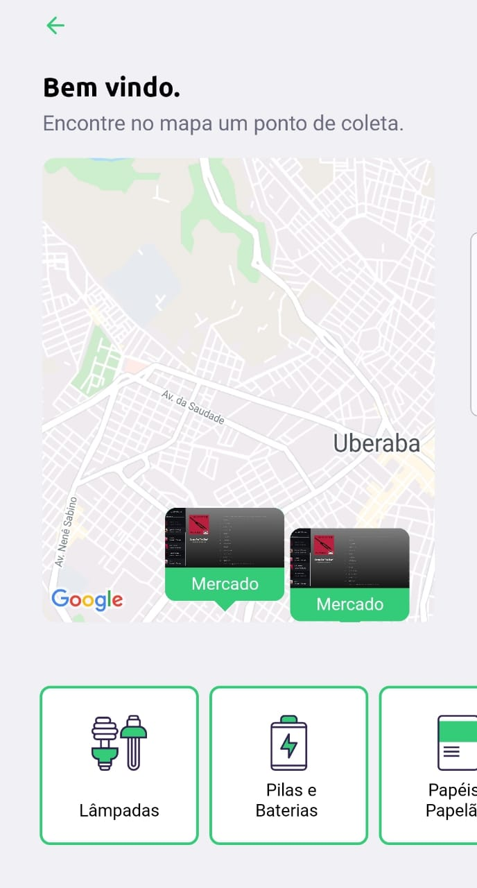

# Ecoleta-mobile
Waste collection project. Developed during the NLW (Next Level Week) offered by Rocketseat

{:height="50px" width="50px"}

## Technologies

- [React native](https://reactnative.dev/)
- [expo](https://expo.io/)
- [axios](https://github.com/axios/axios)

##  Project

Ecoleta is a project to provide locations that perform waste collection

## How to Run

1. Install the dependencies with `npm i`.
2. Run your application with `npm start` to inicialize the expo on browser.
